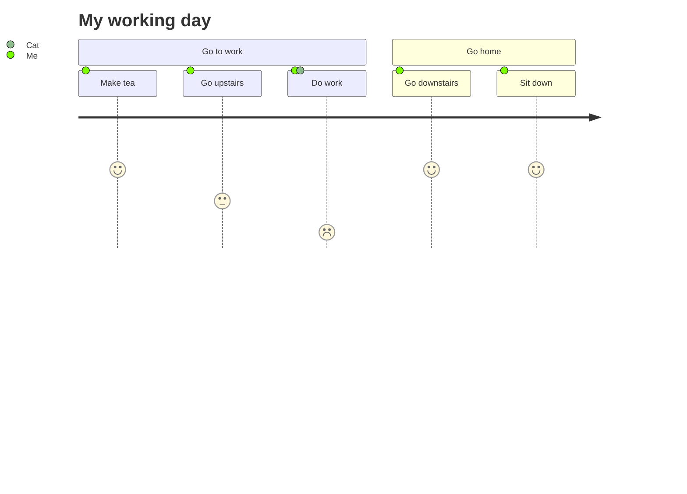

Features of Garden ...

- [x] mdx support
- [x] mermaid support
- [x] excerpt
- [ ] math support
- [ ] code block
- [ ] side comment
- [ ] comment
- [ ] search with Thai language
- [ ] render React component inside markdown
- [ ] short cut
- [ ] style customization

### MDX

  <h3>This is JSX</h3>

### Mermaid Based Graphs

